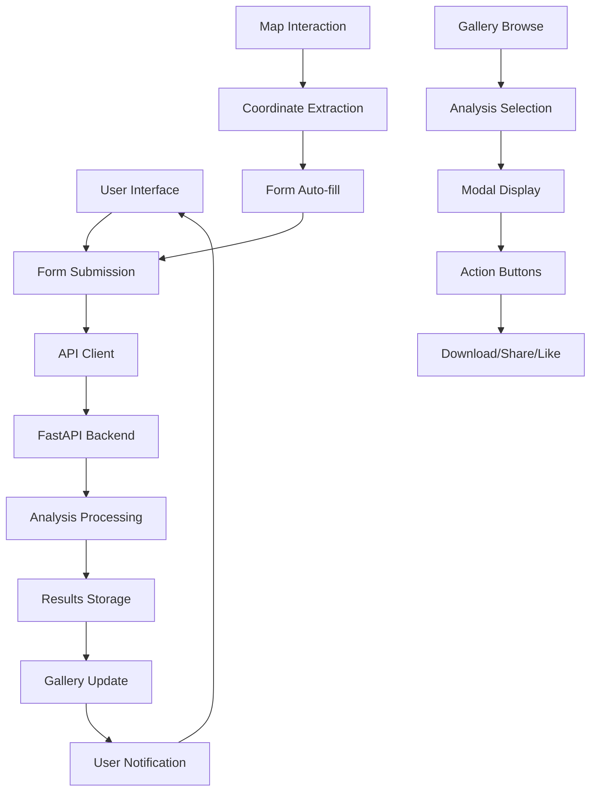

# 🛰️ LLEO (Large Language Models for Earth Observation) Frontend Architecture

## Technology Stack

- **Framework**: Next.js 14+ with TypeScript
- **Styling**: Tailwind CSS with custom green-amber gradient theme
- **Maps**: Leaflet/Mapbox for interactive map functionality
- **UI Library**: Custom component library with Lucide React icons
- **State Management**: React hooks with custom state management
- **Backend Integration**: REST API client for FastAPI backend with 10-minute timeouts
- **Authentication**: Ready for Supabase integration (suggestion2.md)

## Project Structure

```
geoanalytics-platform/
├── 📁 src/
│   ├── 📁 app/                     # Next.js App Router
│   │   ├── layout.tsx              # Root layout component
│   │   ├── page.tsx                # Main homepage with chatbot interface (primary entry point)
│   │   ├── layout_v1.tsx           # Legacy layout version
│   │   ├── page_v1.tsx             # Legacy page version
│   │   ├── page_v2.tsx             # Alternative page version
│   │   ├── contact/
│   │   │   └── page.tsx            # Contact page with form and FAQs
│   │   ├── privacy/
│   │   │   └── page.tsx            # Privacy Policy page
│   │   └── terms/
│   │       └── page.tsx            # Terms of Service page
│   │
│   ├── 📁 components/              # React Components
│   │   ├── 📁 analysis/            # Analysis form components
│   │   │   ├── AnalysisForm.tsx    # Legacy analysis form
│   │   │   ├── ModernAnalysisForm.tsx       # Main analysis form (current)
│   │   │   └── ModernAnalysisForm_v1.tsx    # Form variant
│   │   │
│   │   ├── 📁 chat/                # Chat interface components (NEW)
│   │   │   ├── ChatInterface.tsx   # Main chat input with file upload
│   │   │   └── ExamplePrompts.tsx  # Clickable example prompt cards
│   │   │
│   │   ├── 📁 gallery/             # Gallery display components
│   │   │   ├── AnalysisCard.tsx    # Individual analysis cards (green-amber theme)
│   │   │   ├── AnalysisCard_v1.tsx # Legacy card version
│   │   │   ├── AnalysisGallery.tsx # Gallery grid layout (green-amber theme)
│   │   │   └── AnalysisGallery_v1.tsx # Legacy gallery version
│   │   │
│   │   ├── 📁 layout/              # Layout components
│   │   │   ├── Header.tsx          # Navigation header with LLEO branding
│   │   │   ├── Header_v1.tsx       # Legacy header version
│   │   │   ├── Header_v2.tsx       # Alternative header version
│   │   │   ├── Footer.tsx          # Page footer with green theme
│   │   │   └── button.tsx          # Reusable button component
│   │   │
│   │   ├── 📁 map/                 # Map functionality
│   │   │   └── InteractiveMap.tsx  # Leaflet map with drawing tools
│   │   │
│   │   ├── 📁 modal/               # Modal dialogs
│   │   │   ├── AnalysisModal.tsx   # Analysis detail modal (current)
│   │   │   └── AnalysisModal_v1.tsx # Legacy modal version
│   │   │
│   │   └── 📁 ui/                  # Base UI components
│   │       ├── Button.tsx          # Button variants
│   │       ├── Card.tsx            # Card containers
│   │       ├── Toast.tsx           # Notification system
│   │       ├── LoadingSpinner.tsx  # Loading animations
│   │       └── LoadingState.tsx    # Loading state components
│   │
│   ├── 📁 hooks/                   # Custom React hooks
│   │   ├── useLocalStorage.ts      # Local storage management
│   │   └── useToast.ts             # Toast notification hook
│   │
│   ├── 📁 types/                   # TypeScript definitions
│   │   ├── analysis.ts             # Analysis data types (current)
│   │   ├── analysis_v1.ts          # Legacy analysis types
│   │   └── ui.ts                   # UI component types
│   │
│   └── 📁 utils/                   # Utility functions
│       ├── api.ts                  # Backend API client (current)
│       ├── api_v1.ts               # Legacy API version
│       ├── api_v2.ts               # Alternative API version
│       ├── cn.ts                   # Class name utilities (clsx/tailwind-merge)
│       ├── sample-data.ts          # Demo data for development
│       └── storage.ts              # Storage utilities
│
├── 📁 public/                      # Static assets
│   └── leaflet/                    # Leaflet map icons and assets
│
├── 📁 .next/                       # Next.js build output
├── 📁 node_modules/                # Dependencies
├── 📁 .git/                        # Git repository
├── 📁 .claude/                     # Claude Code settings
│
└── 📄 Configuration Files
    ├── package.json                # Dependencies and scripts
    ├── next.config.js              # Next.js configuration
    ├── tailwind.config.js          # Tailwind CSS configuration
    ├── tsconfig.json               # TypeScript configuration
    ├── postcss.config.js           # PostCSS configuration
    ├── .env                        # Environment variables
    ├── .env.local                  # Local environment overrides
    ├── .gitignore                  # Git ignore rules
    └── README.md                   # Project documentation
```

## Key Features Architecture

### Modern Chatbot Interface (NEW DESIGN)
The application has been redesigned from a tab-based interface to a modern AI chatbot interface similar to Claude/ChatGPT/Gemini.

#### Main Interface Components:
1. **ChatInterface** - Central input field with file upload capability
2. **ExamplePrompts** - Clickable prompt cards for easy interaction
3. **Tab-Based Navigation** - Access to different sections via header tabs

#### Navigation Tabs:
Located in `src/app/page.tsx` with URL parameter support:
1. **Create Analysis** - ChatGPT-style interface with LLEO branding
2. **My Analyses** - User's personal analysis history with filtering
3. **Community Research** - Public shared analyses
4. **Pricing** - Subscription plans ($29/month annual, $39/month monthly)

### Core Components

#### Main Application Entry Point
- **`src/app/page.tsx`** - Primary homepage component with full feature set
- **`src/app/layout.tsx`** - Root layout with global styles and providers

#### Analysis Creation Flow
- **`ModernAnalysisForm`** (`src/components/analysis/ModernAnalysisForm.tsx`)
  - Main analysis creation interface
  - Integrates with interactive map for area selection
  - Handles file uploads (GCP credentials)
  - Form validation and submission

#### Map Integration
- **`InteractiveMap`** (`src/components/map/InteractiveMap.tsx`)
  - Leaflet-based map with drawing tools
  - Rectangle selection for analysis areas
  - Automatic coordinate extraction
  - Real-time area calculation

#### Gallery System
- **`AnalysisGallery`** (`src/components/gallery/AnalysisGallery.tsx`)
  - 4-per-row grid layout as specified
  - Advanced filtering and search capabilities
  - Multiple view modes (grid/list)
  - Real-time updates

- **`AnalysisCard`** (`src/components/gallery/AnalysisCard.tsx`)
  - Individual analysis display cards
  - Thumbnail previews
  - Metadata display (author, date, location)
  - Action buttons (view, like, share, download)

#### Modal System
- **`AnalysisModal`** (`src/components/modal/AnalysisModal.tsx`)
  - Detailed analysis view
  - Full metadata display
  - Download and sharing options
  - Interactive charts and maps

### Backend Integration

#### API Client (`src/utils/api.ts`) - ENHANCED
- **Health Check**: `checkApiHealth()` - Backend connectivity monitoring with timeout handling
- **Analysis Submission**: `submitAnalysis()` - Form data and file upload with 10-minute timeout
- **Gallery Management**: `getUserGallery()` - User's analysis history with retry logic
- **File Operations**: `downloadAnalysisZip()` - Result downloads with retry mechanism
- **Map Integration**: `openAnalysisMap()` - Interactive result maps
- **GCP Optimization**: `keepGCPWarm()` - Prevents cold starts with periodic health pings
- **Error Handling**: `formatApiError()` - User-friendly error messages for timeouts and network issues
- **Retry Logic**: `fetchWithRetry()` - Exponential backoff for failed requests

#### Expected Backend Endpoints
- `GET /health` - Health check and project info
- `POST /analyze` - Submit analysis with form data
- `GET /gallery/{user_id}` - User's analysis gallery
- `GET /download/{session_id}` - Download analysis results
- `GET /map/{session_id}` - Interactive map view

### State Management Architecture

#### Local State (React Hooks)
- **Analysis State**: Form data, submission status, results
- **Gallery State**: User analyses, community analyses, filters
- **UI State**: Active tabs, modal visibility, loading states
- **User State**: User ID, preferences, session data

#### Custom Hooks
- **`useToast`** (`src/hooks/useToast.ts`)
  - Toast notification system
  - Success, error, warning, and info messages
  - Auto-dismiss with configurable duration

- **`useLocalStorage`** (`src/hooks/useLocalStorage.ts`)
  - Persistent local storage management
  - User preferences and session data
  - Type-safe storage operations

### Data Flow Architecture



### Component Hierarchy

```
HomePage (src/app/page.tsx)
├── Header (navigation tabs)
├── TabContent (conditional rendering)
│   ├── Create Analysis Tab
│   │   ├── Hero Section
│   │   ├── ModernAnalysisForm
│   │   │   └── InteractiveMap
│   │   └── Resources Section
│   │
│   ├── My Analyses Tab
│   │   └── AnalysisGallery
│   │       └── AnalysisCard[]
│   │
│   ├── Community Tab
│   │   └── AnalysisGallery
│   │       └── AnalysisCard[]
│   │
│   └── Pricing Tab
│       └── Pricing Cards
│
├── Footer
├── AnalysisModal (overlay)
├── Toast Container
└── API Status Indicator
```

## Development Patterns

## New Pages and Features (Recent Updates)

### Legal and Contact Pages
- **Contact Page** (`/contact`) - Professional contact form with category selection, FAQs, and responsive design
- **Privacy Policy** (`/privacy`) - Comprehensive privacy policy covering data collection, usage, and user rights
- **Terms of Service** (`/terms`) - Complete legal terms including prohibited uses, billing, and liability sections

### Chatbot Interface Redesign
- **Main Page Redesign** - Transformed from tab-based to ChatGPT-style interface
- **LLEO Branding** - Updated from "GeoLLM" to "LLEO (Large Language Models for Earth Observation)"
- **Example Prompts** - Interactive cards for common analysis types (environmental monitoring, urban planning, etc.)
- **Central Chat Input** - Modern chat interface with drag-and-drop file upload

### Theme and Design Updates
- **Color Scheme** - Consistent green-to-amber gradients throughout the application
- **Visual Consistency** - All purple/blue elements updated to match green-amber theme
- **Enhanced UX** - Better loading states, error messages, and user feedback

### Styling Architecture
- **Tailwind CSS** for utility-first styling
- **Green-Amber Theme** - Consistent gradient color scheme across all components
- **Glass morphism effects** and smooth animations
- **Responsive design** with mobile-first approach
- **LLEO Branding** - Professional satellite/earth observation aesthetic

### TypeScript Integration
- **Strict typing** throughout the application
- **Custom type definitions** in `src/types/`
- **API response types** for backend integration
- **Component prop interfaces** for reusability

### Version Management
The project maintains multiple versions of key components:
- **Current versions**: Primary components in active use
- **Legacy versions** (v1): Previous implementations kept for reference
- **Alternative versions** (v2): Experimental or alternative approaches

### Performance Optimizations
- **Lazy loading** for gallery images and maps
- **Component memoization** for expensive renders
- **API response caching** for improved performance
- **Optimized bundle splitting** with Next.js

### GCP Integration Optimizations (NEW)
- **10-Minute Timeouts** - Extended timeouts for both local and GCP environments
- **Retry Logic** - Automatic retry with exponential backoff for failed requests
- **Keep-Alive System** - Prevents GCP Cloud Run cold starts with periodic health pings
- **Connection Monitoring** - Real-time connection status indicators
- **Error Handling** - User-friendly timeout messages explaining GCP startup delays
- **CORS Configuration** - Proper cross-origin headers for GCP Cloud Run deployment

## Environment Configuration

### Required Environment Variables
```bash
# Backend API URL (supports both local and GCP)
NEXT_PUBLIC_API_URL=http://localhost:8000
# For GCP deployment:
# NEXT_PUBLIC_API_URL=https://ndvi3-analysis-api-258557095482.us-central1.run.app

# Application metadata
NEXT_PUBLIC_APP_NAME=LLEO
NEXT_PUBLIC_APP_VERSION=1.0.0

# Future Supabase Authentication (see suggestion2.md)
# NEXT_PUBLIC_SUPABASE_URL=your_supabase_project_url
# NEXT_PUBLIC_SUPABASE_ANON_KEY=your_supabase_anon_key
```

### Development Scripts
```bash
npm run dev          # Development server
npm run build        # Production build
npm run start        # Production server
npm run lint         # ESLint checking
npm run type-check   # TypeScript validation
```

## Deployment Architecture

### Production Build
- **Static generation** where possible
- **Server-side rendering** for dynamic content
- **Edge deployment** compatible (Vercel, Netlify)
- **Docker containerization** support

### Performance Metrics
- **Core Web Vitals** optimization
- **Lighthouse score** monitoring
- **Bundle size** optimization
- **Loading performance** tracking

## Recent Architectural Changes (September 2024)

### Major Interface Redesign
1. **Chatbot Interface** - Transformed from tab-based to modern AI chat interface
2. **Brand Evolution** - Updated from GeoAnalytics to LLEO branding
3. **Theme Unification** - Consistent green-amber gradient across all components

### Backend Integration Improvements
1. **Timeout Optimization** - Increased to 10 minutes for both environments
2. **GCP Cloud Run Support** - Optimized for serverless deployment
3. **Connection Resilience** - Retry logic and keep-alive mechanisms
4. **Error User Experience** - Clear messages for timeout and network issues

### New Page Structure
1. **Legal Compliance** - Added Privacy Policy and Terms of Service pages
2. **Professional Contact** - Enhanced contact page with categorized support
3. **Navigation Enhancement** - URL parameter support for deep linking

### Authentication Ready
- **Supabase Integration** - Complete authentication system documented in `suggestion2.md`
- **User Management** - Ready for transition from localStorage to proper auth
- **Session Persistence** - Designed for cross-device analysis history

---

**Last Updated**: September 2024
**Version**: 2.0.0 (Major Interface Redesign)
**Built with**: Next.js 14, TypeScript, Tailwind CSS, Leaflet
**Backend**: FastAPI with GCP Cloud Run deployment
**Authentication**: Ready for Supabase integration